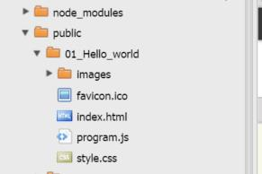

# yr11sdd2015

## Installation steps

### Use Google Chrome as your web browser.

1. Goto github: https://github.com/ and Sign up for GitHub. Use your schools email address.
2. Goto Cloud 9: "https://c9.io/ and Sign up for Cloud 9. Use 'Sign up with GitHub' and use your details from step 1.
3. logon to <a href="https://c9.io" target="_blank">c9.io</a>
4. Press green button `CREATE NEW WORKSPACE`<br />

5. Select `Clone From URL`<br />
  <br />
6. Paste the following url: 
```
  https://github.com/stlukesdy/computingclub2015.git
```

  - Select Workspace Privacy: **Open and Discoverable**<br />
  - Select **Custom**<br />
  - Click **Create**<br />

4. Select the new workspace `computingclub2015`.
5. Click **START EDITING**. Wait until loaded.
6. In your bash shell type the following command:<br /><br />
```
npm install
```
7. Again, in your bash shell type the following command:<br /><br />
```
grunt
```

8. Open in chrome `https://computingclub2015-{your username}.c9.io/`
9. Find the code files in cloud 9 file explorer:<br />



## Update steps


1. logon to <a href="https://c9.io" target="_blank">c9.io</a>
2. Select the new workspace `yr11sdd2015`.
3. Click **START EDITING**. Wait until loaded.
4. Open new Terminal Alt-T (Window --> New Terminal).
5. In your new terminal bash shell type the following command:`git pull`
6. Close the new Terminal created in step 4.
